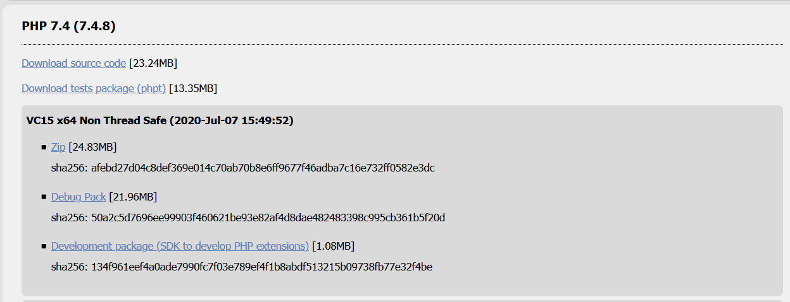
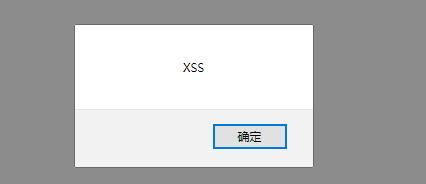

# XSS漏洞

## 实验要求
- 实现XSS攻击

## 实验过程
### PHP安装
- 下载


- 将下载的压缩包移动到`C:\php`并解压,然后在`C:\php`文件夹下新建文件`php.ini`，内容与`php.ini-production`的相同.
- 取消`extension_dir = "ext"`的注释
- PHP的根目录改为绝对路径
- 将`E:\php`添加至环境变量
- 修改用户设置`settings.json`，添加
    ```js
    "php.executablePath": "C:\\php\\php.exe",
    "php.validate.executablePath": "C:\\php\\php.exe",
    "php.validate.enable": true,
    "php.validate.run": "onType",
    "phpserver.phpPath": "C:\\php\\php.exe",
    ```
-  安装插件 PHP Server

### 网页实现XSS攻击
- 基本网页

- 代码
    ```php
    <!DOCTYPE html>
    <html>
    <head>
        <meta charset="UTF-8">
        <title>Weak Website</title>
    </head>
    <body>
        <form method="post">
            <input type="text" name="xss">
            <input type="submit" value="提交">
        </form>
        <?php
            if(isset($_POST["xss"]))
            {
                echo $_POST["xss"];
            }
        ?>
    </body>
    </html>
    ```
- 实现



