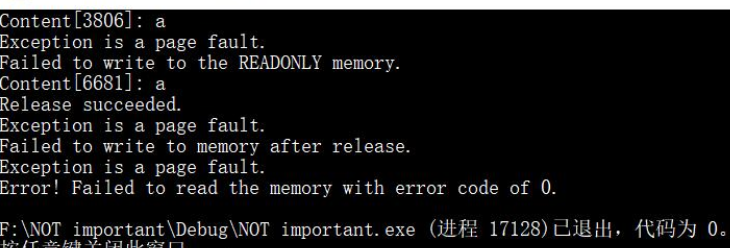

# 内存管理

## 实验要求

- [x] 阅读 VirtualAlloc、VirtualFree、VirtualProtect 等函数的官方文档
- [x] 编程使用`malloc`分配一段内存，测试这段内存所在的整个 4KB 区域是否都可以写入读取
- [x] 使用 VirtualAlloc 分配一段可读可写的内存，写入内存，然后将这段内存改为只读，再读数据和写数据，看是否会有异常情况。接着 VirtualFree 这段内存，再测试对这段内存的读写是否正常。
##  实验过程
-  分配内存代码
```c
#include<stdio.h>
#include<malloc.h>
int main()
{

    printf("int所占的字节数为sizeof(int) = %d\n", sizeof(int));
    int len1 = 1e2;
    int len2 = 1024;
    int* a = (int*)malloc(sizeof(int) * len1);
    // 4KB以内
    for (int i = 0; i < len2; i++) {
        a[i] = i;
    }
    for (int i = 0; i < len2; i++) {
        printf("a[%d]=%d ", i, a[i]);
    }
    puts("\n\n4KB success!!\n");
    // 超过4KB
    for (int i = len2; i < len2 + 100; i++) {
        a[i] = i;
    }
    for (int i = len2; i < len2 + 100; i++) {
        printf("a[%d]=%d ", i, a[i]);
    }
    puts("\n\nOver 4KB success!!\n\n");
    return 0;
}
```
- 检测读写释放代码
```c
    #include<windows.h>
    #include<stdio.h>
    #include<stdlib.h>
    #include<time.h>

    #define PAGELIMIT 5 // Number of pages to ask for

    DWORD dwPageSize;       // Page size on this computer
    LPTSTR lpPtr;       // Generic character pointer

    int PageFaultExceptionFilter(DWORD dwCode)
    {
        // If the exception is not a page fault, exit.
        if (dwCode != EXCEPTION_ACCESS_VIOLATION)
        {
            printf("Exception code = %d.\n", dwCode);
            return EXCEPTION_EXECUTE_HANDLER;
        }
        printf("Exception is a page fault.\n");
        return EXCEPTION_EXECUTE_HANDLER;
    }

    void ErrorExit(LPTSTR lpMsg)
    {
        printf("Error! %s with error code of %ld.\n", lpMsg, GetLastError());
        exit(0);
    }

    void ReadTest()
    {
        __try
        {
            // 访问页内随机地址
            int add = rand() % (PAGELIMIT * dwPageSize);
            printf("Content[%d]: %c\n", add, lpPtr[add]);
        }
        __except (PageFaultExceptionFilter(GetExceptionCode()))
        {
            ErrorExit("Failed to read the memory");
        }
    }

    int main()
    {
        srand(time(NULL));

        LPVOID lpvBase;     // Base address of the test memory
        SYSTEM_INFO sSysInfo;	// Useful information about the system
        BOOL bSuccess;      // Flag

        GetSystemInfo(&sSysInfo);     // Initialize the structure.

        dwPageSize = sSysInfo.dwPageSize;

        lpvBase = VirtualAlloc(
            NULL,	// System selects address
            PAGELIMIT * dwPageSize,	// 分配的大小
            MEM_COMMIT|MEM_RESERVE,	// To reserve and commit pages in one step
            PAGE_READWRITE	// 可读可写
        );
        if (lpvBase == NULL)
            ErrorExit("VirtualAlloc reserve failed");

        lpPtr = (LPTSTR)lpvBase;

        for (int i = 0; i < PAGELIMIT * dwPageSize; i++)
        {
            __try
            {
                lpPtr[i] = 'a';	// 写入内存
            }
            __except(PageFaultExceptionFilter(GetExceptionCode()))
            {
                ErrorExit("Failed to write to memory");
            }
        }

        ReadTest();

        DWORD oldProtect;
        bSuccess = VirtualProtect(
            lpvBase,
            PAGELIMIT * dwPageSize,	// 需要改变访问属性的区域大小
            PAGE_READONLY,		// 只读
            &oldProtect	// 在修改前，旧的访问属性将被存储
        );

        if (bSuccess == 0)
            ErrorExit("Change access protection attributes failed");

        for (int i = 0; i < PAGELIMIT * dwPageSize; i++)
        {
            __try
            {
                lpPtr[i] = 'b';	// 写入内存
            }
            __except (PageFaultExceptionFilter(GetExceptionCode()))
            {
                printf("Failed to write to the READONLY memory.\n");
                break;
            }
        }

        ReadTest();

        bSuccess = VirtualFree(
            lpvBase,       // Base address of block
            0,             // Bytes of committed pages
            MEM_RELEASE);  // Decommit the pages
        printf("Release %s.\n", bSuccess ? "succeeded" : "failed");

        for (int i = 0; i < PAGELIMIT * dwPageSize; i++)
        {
            __try
            {
                lpPtr[i] = 'c';	// 写入内存
            }
            __except (PageFaultExceptionFilter(GetExceptionCode()))
            {
                printf("Failed to write to memory after release.\n");
                break;
            }
        }

        ReadTest();
    }

```
 - 运行结果
  

- 可以看出

  - 由 VirtualAlloc 分配的 PAGE_READWRITE（可读可写）内存可以正常的写入和读取
  - 将访问属性修改为 PAGE_READONLY 后，该段内存无法写入，但可以正常读取
  - 使用 VirtualFree 之后，该段内存无法进行写入和读取
  - VirtualAlloc 的 dwSize 参数描述中提到：分配的页面包含从 lpAddress 到 lpAddress + dwSize 范围内的一个或多个字节的所有页面，证明分配是以页为单位，因此，内存地址管理的基本单位为 4KB 。