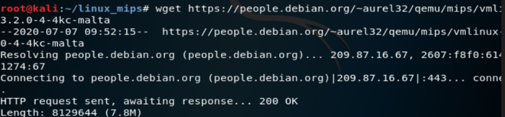

# Fuzzing

## 实验要求

- [x] 搜集市面上主要的路由器厂家、在厂家官网中寻找可下载的固件，在 CVE 漏洞数据中查找主要家用路由器厂家已经公开的漏洞，选择一两个能下载到且有已经公开漏洞的固件
- [ ] 下载对应版本的固件后，在 QEMU 中模拟运行。确定攻击面（对哪个端口哪个协议进行 Fuzzing 测试），尽可能多的抓取攻击面正常的数据包（Wireshark）
- [ ] 查阅 BooFuzz 的文档，编写对这个攻击面，这个协议的脚本，进行 Fuzzing。配置 BooFuzz QEMU 的崩溃异常检测，争取触发一次固件崩溃，获得崩溃相关的输入测试样本和日志
- [ ] 尝试使用调试器和 IDA-pro 监视目标程序的崩溃过程，分析原理
## 实验环境
* kali linux

## 实验过程

* 安装QEMU
```
sudo apt install qemu qemu-system qemu-user-staticqemu-user
```

* 下载固件
```
wget http://legacyfiles.us.dlink.com/DIR-866L/REVA/FIRMWARE/DIR-866L_REVA_FIRMWARE_1.00B07.ZIP
```
* 解压
```
unzip DIR-866L_REVA_FIRMWARE_1.00B07.ZIP
```
* 提取
```
binwalk -e DIR866LA1_FW100B07.bin
```
* 下载合适版本预编译的 kernel 和 文件系统镜像
```
mkdir linux_mips; cd linux_mips
wget https://people.debian.org/~aurel32/qemu/mips/vmlinux-3.2.0-4-4kc-malta
wget https://people.debian.org/~aurel32/qemu/mips/debian_wheezy_mips_standard.qcow2

```

